# Frontend Mentor - Time tracking dashboard


The project was based on the challenge provided by [Frontend Mentor](https://www.frontendmentor.io).


This is a solution to the [Time tracking dashboard challenge on Frontend Mentor](https://www.frontendmentor.io/challenges/time-tracking-dashboard-UIQ7167Jw). 

## The design provided


## Table of contents

- [User Stories](#user-stories)
- [Features](#features)
- [Technologies Used](#technologies-used)
- [Design](#design)
- [Bugs](#bugs)
- [Testing](#testing)
  - [Compatibility](#compatibility)
  - [Validator testing](#validator-testing)
  - [Compatibility](#compatibility)
- [Deployment](#deployment)
- [Author](#author)
- [Credits](#credits)
- [Acknowledgments](#acknowledgments)


I was using design files provided for this challenge in order to make the result look as similar as possible to the provided images.

I have also added various breakpoints in order to provide the best user experience.

The solution to this challenge can be accessed by this [link](https://iuliiakonovalova.github.io/frontend_mentor_time_tracking_dashboard/)

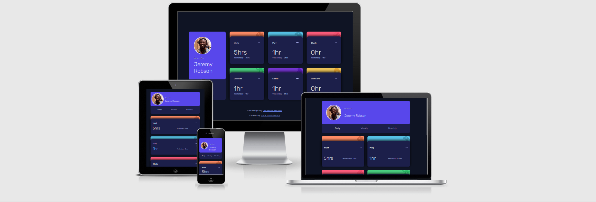


---
## User Stories

### First Time Visitor Goals:

* As a First Time Visitor, I want to easily understand the main purpose of the app, so I can learn more about this app.
* As a First Time Visitor, I want to be able to easily navigate through the app, so I can find the content.
* As a First Time Visitor, I want to find the app useful.

### Frequent Visitor Goals:
* As a Frequent User, I want to get my personal information, so I can track the time that I spend on different activities during the day.
* As a Frequent User, I want to have different options for tracking the time, so I can make prudent decision on how I spend my personal time. 

---

## Features

+ ### Main Page

    - Represent: 

        * the time tracking dashboard.

    - Consist:

        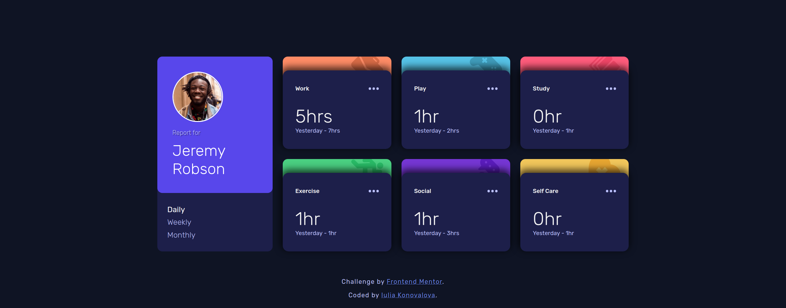

        * Has the main card with personal information for the user and the time options.

        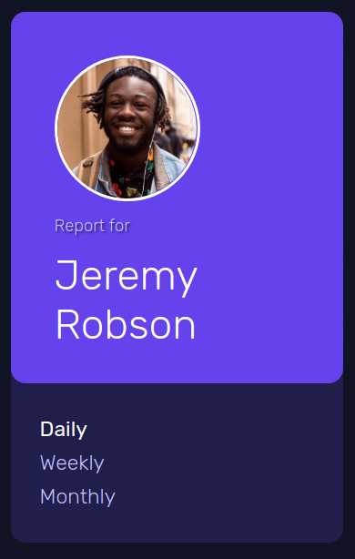

        * Has the main card with personal information for the user.

        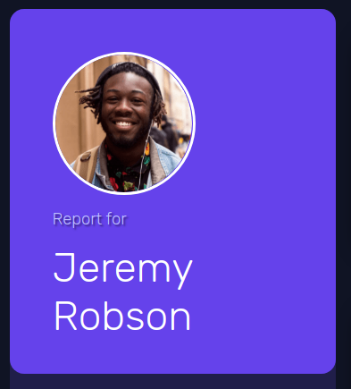

        * Has three buttons under personal information card which allows the user to peek the time duration.

        

        * Has three cards: work, study, play, exercise, social and sef-care, which allows the user to track the time spending on those activities during a day, a week , and a month.

        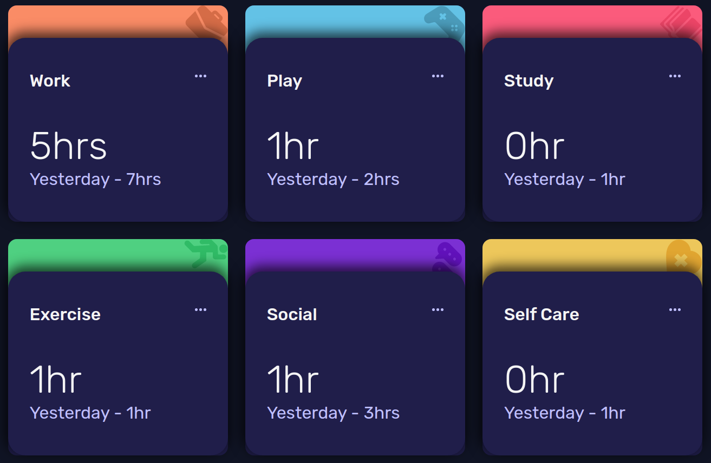

        * These cards also show the time that had been spent recently on those activities and the time that had been spend the day before, a week before, and a month before.

        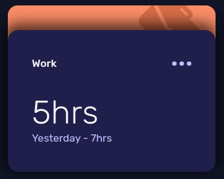

        * Has a link to [Frontend Mentor](https://www.frontendmentor.io) website, which provided all images and required design as well as the link to my github account [Iuliia Konovalova](https://github.com/IuliiaKonovalova)

        

---

## Technologies Used

- [HTML](https://developer.mozilla.org/en-US/docs/Web/HTML) - was used as the foundation of the site.
- [CSS](https://developer.mozilla.org/en-US/docs/Web/css) - was used to add the styles and layout of the site.
- [CSS Flexbox](https://developer.mozilla.org/en-US/docs/Learn/CSS/CSS_layout/Flexbox) - was used to arrange items simmetrically on the pages.
- [CSS Grid](https://developer.mozilla.org/en-US/docs/Web/CSS/grid) - was used to make "gallery" and "contact" pages responsive.
- [CSS roots](https://developer.mozilla.org/en-US/docs/Web/CSS/:root) - was used to declaring global CSS variables and apply them throughout the project. 
- [VSCode](https://code.visualstudio.com/) - was used as the main tool to write and edit code.
- [Git](https://git-scm.com/) - was used for the version control of the website.
- [GitHub](https://github.com/) - was used to host the code of the website.
- [GIMP](https://www.gimp.org/) - was used to make and resize images for the README file.
- [JS](https://www.javascript.com/) - was used to display content on the page.
- [async functions](https://developer.mozilla.org/en-US/docs/Web/JavaScript/Reference/Statements/async_function) - were used to fetch the data from the local json file.

---
## Design

- The color scheme and font-family were provided by [Frontend Mentor](https://www.frontendmentor.io).

- Background Color:


- Cards Background Color:


- Work Card Top Color:


- Play Card Top Color:


- Study Card Top Color:


- Exercise Card Top Color:


- Social Card Top Color:


- Self Care Card Top Color:


- Text Color:


- Accent Text Color:


- Font-family (Rubik):

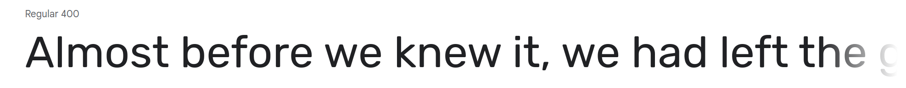

---

## Bugs
+ **Solved bugs**

1. The functions that pushes data from the json file did not represent 'hr' and 'hr' correctly.

    - *Solutions:* Add the ternary operator ```data[i].timeframes.daily.current > 1 ? "hrs" : "hr"```.
    

+ **Unsolved bugs**

    - None.

---


## Testing
### Compatibility:

+ The app was tested on the following browsers: Chrome, Firefox, Brave, Edge:

  - Chrome:

  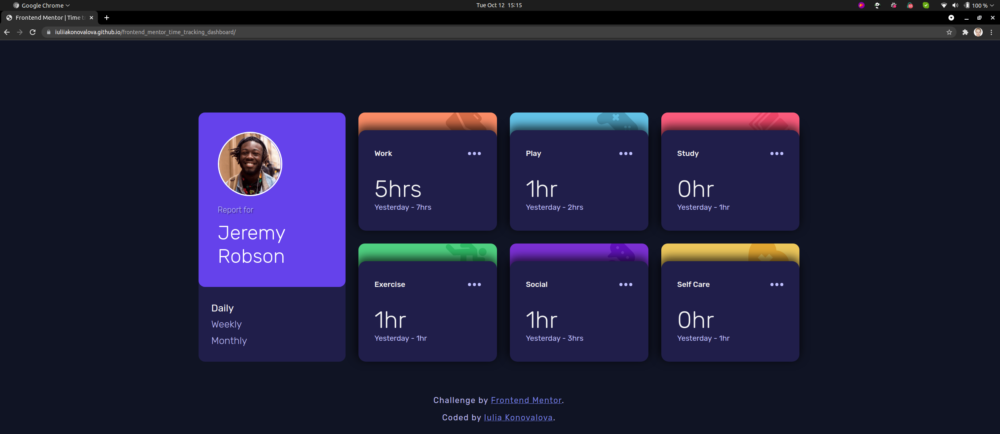
  
  - Firefox:

  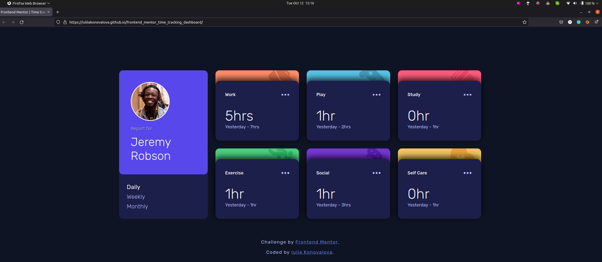

  - Brave:

  

  - Noted Issues:

    - ```object-fit``` css method does-not work properly in Brave since it Brave support this property only with ``````. Thus, additional code was added to prevent overlap of the elements.

  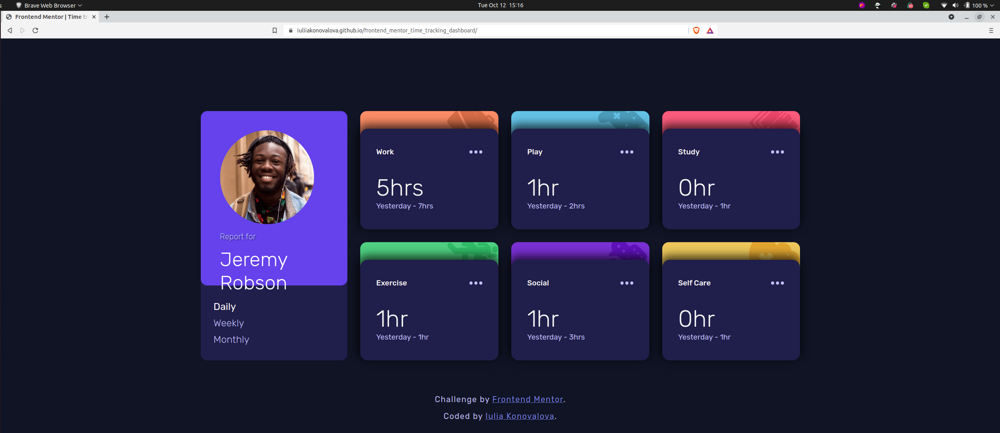


+ The app was checked by devtools implemented on Firefox and Chrome browsers.

+ The app was checked with [Responsive Website Design Tester](https://responsivedesignchecker.com/).

  1. Mobile Screens:

    - Mobile 320x480, 320x568, 360x640, 375x667, 384x640, 411x731, 414x736:

     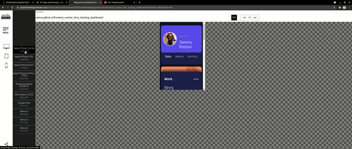

      
  1. Tablets Screens:

    - Tablet 600x960, 768x1024, 800x1280, 1366x1024, 1600x900, 1680x1050, 1920x1080, 1920x1200:
        
    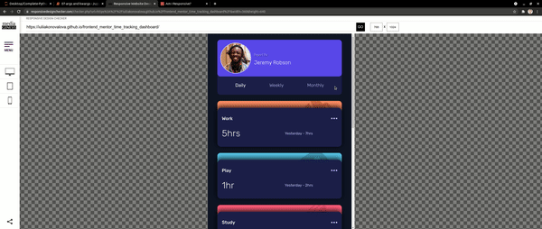
      
  1. Desktop Screens:

    - Desktop 1024x600, 1024x800, 1366x768, 1440x900:
        
    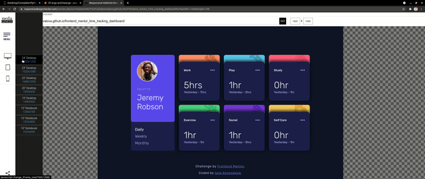

+ The functionality of the links in the app was checked as well by different users.

---
### Validator testing
+ #### HTML
  
  - No errors or warnings were found when passing through the official [W3C](https://validator.w3.org/) validator.
  
    - Main Page:
  
    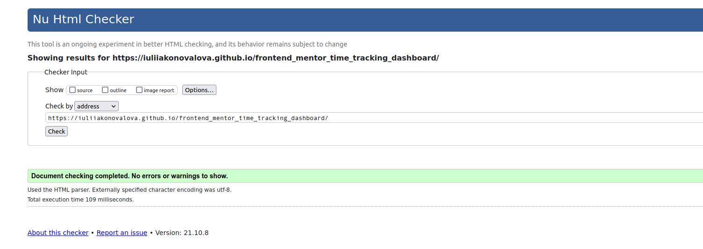
+ #### CSS
  
  - No errors or warnings were found when passing through the official [W3C (Jigsaw)](https://jigsaw.w3.org/css-validator/#validate_by_uri) validator except the 3 warnings: 

  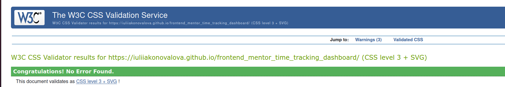

  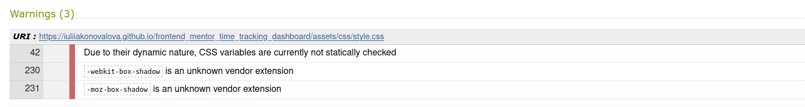
+ #### JS
  
  - No errors or warnings were found when passing through the official [JSHint](https://jshint.com/) validator except the warnings that   

  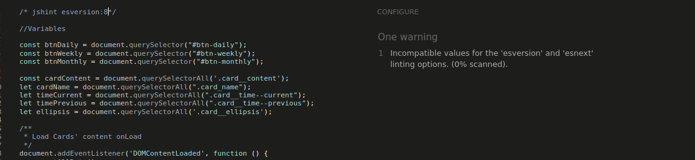

---
## Deployment

- The site was deployed to GitHub pages. The steps to deploy are as follows: 
  - In the [GitHub repository](https://github.com/IuliiaKonovalova/frontend_mentor_time_tracking_dashboard), navigate to the Settings tab 
  - From the source section drop-down menu, select the **Main** Branch, then click "Save".
  - The page will be automatically refreshed with a detailed ribbon display to indicate the successful deployment.

The live link can be found [here](https://iuliiakonovalova.github.io/frontend_mentor_time_tracking_dashboard/)

---
### Local Deployment

In order to make a local copy of this project, you can clone it.
In your IDE Terminal, type the following command to clone my repository:

- `git clone https://github.com/IuliiaKonovalova/frontend_mentor_time_tracking_dashboard.git`

---

## Author

- Website - [Add your name here](https://www.your-site.com)
- Frontend Mentor - [@yourusername](https://www.frontendmentor.io/profile/yourusername)

---

## Credits

+ ### Content and Design

  - [Frontend Mentor](https://www.frontendmentor.io) had provided all necessary content and design that was used in order to complete this challenge.
  - [Google Fonts](https://fonts.google.com/) was usd in order to implement required font.

## Acknowledgement

  - [Frontend Mentor](https://www.frontendmentor.io) for inspiring to improve my skills.

## Wireframes

- Desktop:


- Mobile:


