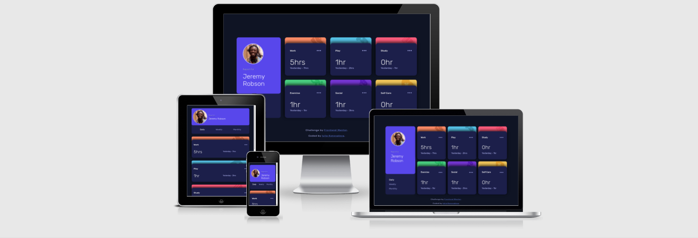
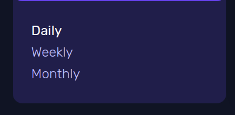
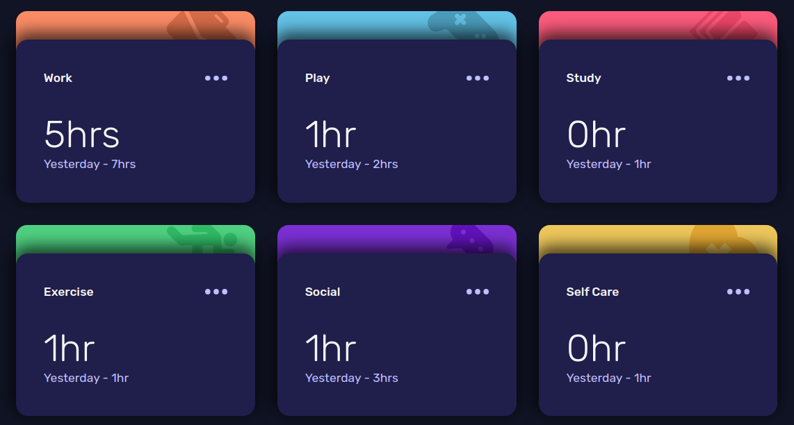
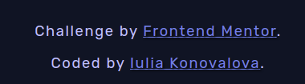
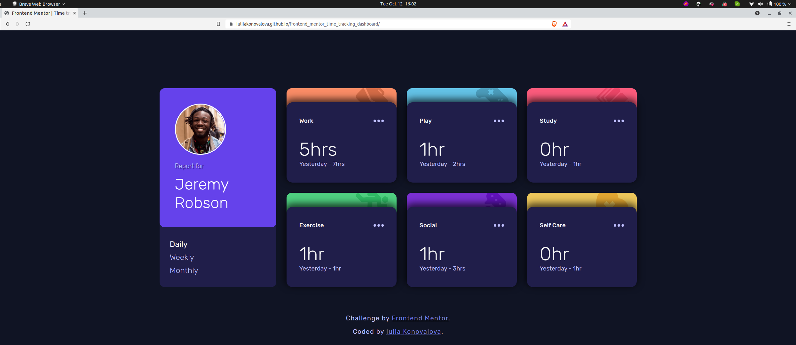

# Frontend Mentor - Time tracking dashboard


The project was based on the challenge provided by [Frontend Mentor](https://www.frontendmentor.io).

I was using design files provided for this challenge in order to make the result look as similar as possible to the provided images.
I have also added various breakpoints in order to provide the best user experience.

---
## The design provided


---

The site can be accessed by this [link](https://iuliiakonovalova.github.io/frontend_mentor_time_tracking_dashboard/)




---
## User Stories

### First Time Visitor Goals:

* As a First Time Visitor, I want to easily understand the main purpose of the app, so I can learn more about this app.
* As a First Time Visitor, I want to be able to easily navigate through the app, so I can find the content.
* As a First Time Visitor, I want to find the app useful.

### Frequent Visitor Goals:
* As a Frequent User, I want to get my personal information, so I can track the time that I spend on different activities during the day.
* As a Frequent User, I want to have different options for tracking the time, so I can make prudent decision on how I spend my personal time. 

---

## Features

+ ### Main Page

    - Represent: 

        * the time tracking dashboard.

    - Consist:

        

        * Has the main card with personal information for the user and the time options.

        

        * Has the main card with personal information for the user.

        

        * Has three buttons under personal information card which allows the user to peek the time duration.

        

        * Has three cards: work, study, play, exercise, social and sef-care, which allows the user to track the time spending on those activities during a day, a week , and a month.

        

        * These cards also show the time that had been spent recently on those activities and the time that had been spend the day before, a week before, and a month before.

        

        * Has a link to [Frontend Mentor](https://www.frontendmentor.io) website, which provided all images and required design as well as the link to my github account [Iuliia Konovalova](https://github.com/IuliiaKonovalova)

        

---

## Technologies Used

- [HTML](https://developer.mozilla.org/en-US/docs/Web/HTML) - was used as the foundation of the site.
- [CSS](https://developer.mozilla.org/en-US/docs/Web/css) - was used to add the styles and layout of the site.
- [CSS Flexbox](https://developer.mozilla.org/en-US/docs/Learn/CSS/CSS_layout/Flexbox) - was used to arrange items simmetrically on the pages.
- [CSS Grid](https://developer.mozilla.org/en-US/docs/Web/CSS/grid) - was used to make "gallery" and "contact" pages responsive.
- [CSS roots](https://developer.mozilla.org/en-US/docs/Web/CSS/:root) - was used to declaring global CSS variables and apply them throughout the project. 
- [VSCode](https://code.visualstudio.com/) - was used as the main tool to write and edit code.
- [Git](https://git-scm.com/) - was used for the version control of the website.
- [GitHub](https://github.com/) - was used to host the code of the website.
- [GIMP](https://www.gimp.org/) - was used to make and resize images for the README file.
- [JS](https://www.javascript.com/) - was used to display content on the page.
- [async functions](https://developer.mozilla.org/en-US/docs/Web/JavaScript/Reference/Statements/async_function) - were used to fetch the data from the local json file.

---
## Design

- The color scheme and font-family were provided by [Frontend Mentor](https://www.frontendmentor.io).

- Background Color:


- Cards Background Color:


- Work Card Top Color:


- Play Card Top Color:


- Study Card Top Color:


- Exercise Card Top Color:


- Social Card Top Color:


- Self Care Card Top Color:


- Text Color:


- Accent Text Color:


- Font-family (Rubik):


---

## Bugs
+ **Solved bugs**

1. The functions that pushes data from the json file did not represent 'hr' and 'hr' correctly.

    - *Solutions:* Add the ternary operator ```data[i].timeframes.daily.current > 1 ? "hrs" : "hr"```.
    

+ **Unsolved bugs**

    - None.

---


## Testing


**COMPATIBILITY:**

+ The app was tested on the following browsers: Chrome, Firefox, Brave, Edge:

  - Chrome:

  
  
  - Firefox:

  

  - Brave:

  

  - Noted Issues:
    - None.


+ The app was checked by devtools implemented on Firefox and Chrome browsers.

+ The app was checked with [Responsive Website Design Tester](https://responsivedesignchecker.com/).


---

## Welcome! 👋

Thanks for checking out this front-end coding challenge.

[Frontend Mentor](https://www.frontendmentor.io) challenges help you improve your coding skills by building realistic projects.

**To do this challenge, you need a basic understanding of HTML, CSS and JavaScript.**

## The challenge

Your challenge is to build out this dashboard and get it looking as close to the design as possible.

You can use any tools you like to help you complete the challenge. So if you've got something you'd like to practice, feel free to give it a go.

If you would like to practice working with JSON data, we provide a local `data.json` file for the activities. This means you'll be able to pull the data from there instead of using the content in the `.html` file.

Your users should be able to:

- View the optimal layout for the site depending on their device's screen size
- See hover states for all interactive elements on the page
- Switch between viewing Daily, Weekly, and Monthly stats

Want some support on the challenge? [Join our Slack community](https://www.frontendmentor.io/slack) and ask questions in the **#help** channel.

### Expected behaviour

- The text for the previous period's time should change based on the active timeframe. For Daily, it should read "Yesterday" e.g "Yesterday - 2hrs". For Weekly, it should read "Last Week" e.g. "Last Week - 32hrs". For monthly, it should read "Last Month" e.g. "Last Month - 19hrs".

## Where to find everything

Your task is to build out the project to the designs inside the `/design` folder. You will find both a mobile and a desktop version of the design.

The designs are in JPG static format. Using JPGs will mean that you'll need to use your best judgment for styles such as `font-size`, `padding` and `margin`.

If you would like the design files (we provide Sketch & Figma versions) to inspect the design in more detail, you can [subscribe as a PRO member](https://www.frontendmentor.io/pro).

You will find all the required assets in the `/images` folder. The assets are already optimized.

There is also a `style-guide.md` file containing the information you'll need, such as color palette and fonts.

## Building your project

Feel free to use any workflow that you feel comfortable with. Below is a suggested process, but do not feel like you need to follow these steps:

1. Initialize your project as a public repository on [GitHub](https://github.com/). Creating a repo will make it easier to share your code with the community if you need help. If you're not sure how to do this, [have a read-through of this Try Git resource](https://try.github.io/).
2. Configure your repository to publish your code to a web address. This will also be useful if you need some help during a challenge as you can share the URL for your project with your repo URL. There are a number of ways to do this, and we provide some recommendations below.
3. Look through the designs to start planning out how you'll tackle the project. This step is crucial to help you think ahead for CSS classes to create reusable styles.
4. Before adding any styles, structure your content with HTML. Writing your HTML first can help focus your attention on creating well-structured content.
5. Write out the base styles for your project, including general content styles, such as `font-family` and `font-size`.
6. Start adding styles to the top of the page and work down. Only move on to the next section once you're happy you've completed the area you're working on.

## Deploying your project

As mentioned above, there are many ways to host your project for free. Our recommend hosts are:

- [GitHub Pages](https://pages.github.com/)
- [Vercel](https://vercel.com/)
- [Netlify](https://www.netlify.com/)

You can host your site using one of these solutions or any of our other trusted providers. [Read more about our recommended and trusted hosts](https://medium.com/frontend-mentor/frontend-mentor-trusted-hosting-providers-bf000dfebe).

## Create a custom `README.md`

We strongly recommend overwriting this `README.md` with a custom one. We've provided a template inside the [`README-template.md`](./README-template.md) file in this starter code.

The template provides a guide for what to add. A custom `README` will help you explain your project and reflect on your learnings. Please feel free to edit our template as much as you like.

Once you've added your information to the template, delete this file and rename the `README-template.md` file to `README.md`. That will make it show up as your repository's README file.

## Submitting your solution

Submit your solution on the platform for the rest of the community to see. Follow our ["Complete guide to submitting solutions"](https://medium.com/frontend-mentor/a-complete-guide-to-submitting-solutions-on-frontend-mentor-ac6384162248) for tips on how to do this.

Remember, if you're looking for feedback on your solution, be sure to ask questions when submitting it. The more specific and detailed you are with your questions, the higher the chance you'll get valuable feedback from the community.

## Sharing your solution

There are multiple places you can share your solution:

1. Share your solution page in the **#finished-projects** channel of the [Slack community](https://www.frontendmentor.io/slack). 
2. Tweet [@frontendmentor](https://twitter.com/frontendmentor) and mention **@frontendmentor**, including the repo and live URLs in the tweet. We'd love to take a look at what you've built and help share it around.
3. Share your solution on other social channels like LinkedIn.
4. Blog about your experience building your project. Writing about your workflow, technical choices, and talking through your code is a brilliant way to reinforce what you've learned. Great platforms to write on are [dev.to](https://dev.to/), [Hashnode](https://hashnode.com/), and [CodeNewbie](https://community.codenewbie.org/).

We provide templates to help you share your solution once you've submitted it on the platform. Please do edit them and include specific questions when you're looking for feedback.

The more specific you are with your questions the more likely it is that another member of the community will give you feedback.

## Got feedback for us?

We love receiving feedback! We're always looking to improve our challenges and our platform. So if you have anything you'd like to mention, please email hi[at]frontendmentor[dot]io.

This challenge is completely free. Please share it with anyone who will find it useful for practice.

**Have fun building!** 🚀

---

## Wireframes

- Desktop


- Mobile


